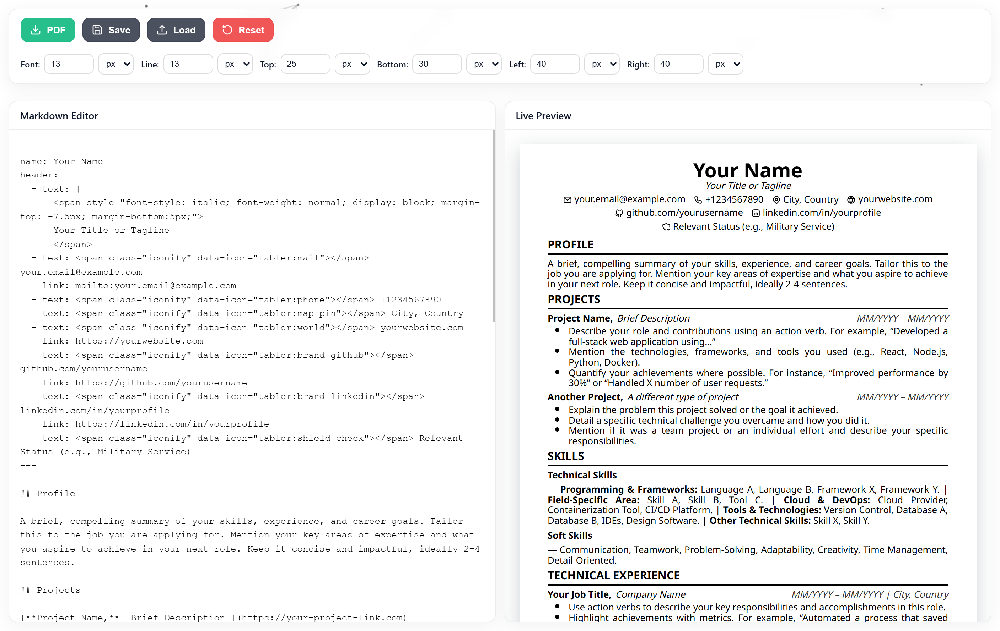

# CV Generator (React + Vite)


A fast, client‑side CV/Resume generator with a live Markdown editor, pixel‑perfect preview, and one‑click PDF via your browser. Built with React + Vite and designed to preserve the original output exactly.



## Highlights

- Live Markdown editor with YAML frontmatter for header content
- Pixel‑perfect preview that matches the original app’s output
- A4 preview page with adjustable margins (visual only; print margins remain browser‑controlled)
- Clean, modern UI with glass toolbar and icon buttons
- Local save/load (browser storage) and one‑click PDF (uses the browser’s print)
- Subtle parallax background (black dots + lines on white) that does not affect print/PDF

## Quick start

Prerequisites: Node 18+ and pnpm.

```bash
pnpm install
pnpm run dev
```

Open the local URL shown in your terminal (typically <http://localhost:5173>).

To build a production bundle:

```bash
pnpm run build
pnpm run preview
```

## How it works

- Content is written in Markdown with optional YAML frontmatter at the top to define the header (name + links).
- Markdown is rendered with `markdown-it` and lightly post‑processed to format project headings/dates.
- The preview injects the same base CSS used for PDF to ensure identical visual output.
- PDF download opens a print‑ready window and calls `window.print()` after fonts/icons are ready.

## Controls (Toolbar)

- PDF: Opens the print dialog and uses your browser’s “Save as PDF”.
- Save / Load: Stores/loads your content and layout settings from browser storage.
- Reset: Restores the default CV template and layout.
- Font size, line height, and margins: Use number + unit pickers with safe constraints.

Notes on margins and PDF:

- The on‑screen preview shows an A4 page with visual padding based on your margin inputs.
- The PDF uses the browser print settings; the visual preview padding is not injected into the printed HTML.

## Tech stack

- React + Vite
- markdown-it (Markdown), js-yaml (frontmatter), Iconify (icons in content)
- lucide-react (toolbar icons)
- react-tsparticles + tsparticles‑slim (parallax background; hidden on print)

## Project structure

```text
src/
  components/
    BackgroundParticles.jsx   # Parallax dots + lines background (screen only)
    Editor.jsx                # Textarea editor
    Preview.jsx               # Live preview with A4 page
    Toolbar.jsx               # Controls (PDF, Save/Load, Reset, layout inputs)
  utils/
    constants.js              # DEFAULT_CV and BASE_CSS copied from original app
    cvParser.js               # Frontmatter parsing + HTML post‑processing
    htmlBuilder.js            # HTML builders for preview and print window
    storage.js                # LocalStorage helpers
  App.jsx
  App.css
  main.jsx
index.html
```

## Customization

- Update `src/utils/constants.js` to change the default CV template or the base resume CSS.
- Adjust the preview page and panel styling in `src/App.css`.
- Tweak the background density/speed in `src/components/BackgroundParticles.jsx`.

## Troubleshooting

- Icons inside the CV don’t render: ensure you’re online; Iconify loads from CDN.
- Fonts not in PDF: the print window waits for fonts, but if your OS blocks them, retry or check network.
- Parallax background feels heavy: lower particle number or link distance in `BackgroundParticles.jsx`.

## License

MIT. Use at your own discretion. The app keeps all data on your device/browser.
